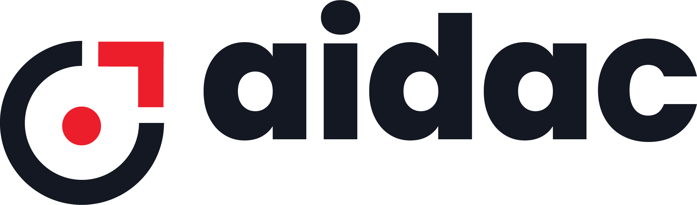

# AIDAC Downloader

AIDAC is and AI Data collection platform and helps streamlining data collection workflows for AI. AIDAC Downloader is part of AIDAC solution and is used to download dataset from cloud storage. AIDAC Downloader utility is usually used at the end of the data collection process to download the approved datasets (after QC).

# Install packages

	pip install -r requirements.txt

# Usage

AIDAC Downloader utility takes the Download Config File (DCF) as input. Please download the DCF from AIDAC dashboard.

To start downloading the dataset run,

	python3 aidac_downloader.py -c downloaded_dcf.json

In case if the project has consent form enabled, aidac_downloader.py utility automatically generates the consent form for every object in PDF format.

